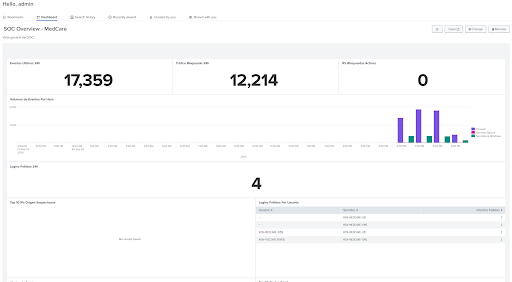

# SOC Lab with Splunk and Automated Response
 
Proof of concept of a Security Operations Center for **MedCare**, a fictitious healthcare SaaS company. The lab detects five attack scenarios in Splunk and responds automatically by blocking the attacker on the firewall or shutting down the switch port they are connected to.
 
Built in **EVE-NG** as a university project (cybersecurity implementation). The written proposal uses a full Cisco stack (Secure Firewall, Splunk Enterprise + SOAR, Talos). In the lab, the firewall is **pfSense with Snort** instead of a Cisco ASA, because of bandwidth limitations in the virtualized environment.



---
 
## Topology
 

 
| Zone | Subnet | Hosts | Firewall policy |
|---|---|---|---|
| WAN | 192.168.1.0/24 | External attacker | NAT to IIS (80) and RDP (3389), `BLOCKED_IPS` deny rule first |
| DMZ | 10.10.1.0/24 | IIS web server | Default deny; only Splunk forwarding, DNS, NTP, HTTP/S out |
| INSIDE | 10.10.2.0/24 | SQL Server, L2 switch | Default deny; only Splunk forwarding, DNS, NTP, HTTP/S out |
| SOC | 10.10.3.0/24 | Splunk | Allowed to reach all zones for monitoring and response |
 
---

## Automated Response
 
Snort runs in **IDS mode**: it only detects and sends alerts to Splunk. All blocking decisions are made centrally by the SIEM through custom alert actions.
 
**External attacks (1, 2, 3, 5)**
```
Attack → logs to Splunk → correlation search fires → block_ip.sh
       → SSH to pfSense → pfctl adds IP to BLOCKED_IPS table → traffic dropped
```
 
**Internal attack (4)**
 
A firewall rule can't stop traffic that never leaves the switch, so the response acts at Layer 2:
```
Attack → EventCode 18456 in Splunk → block_port.sh
       → looks up attacker MAC in pfSense ARP table
       → finds the port on the switch → shutdown via expect script
```
 
| Script | Purpose |
|---|---|
| `block_ip.sh` | Adds attacker IPs from the alert results to the pfSense `BLOCKED_IPS` table |
| `block_port.sh` | Resolves attacker IP → MAC → switch port and shuts it down |
| `shutdown_port.expect` | Handles the interactive IOS session for the port shutdown |
| `flush_blocked.sh` | Clears `BLOCKED_IPS` to reset the lab between demos |
 
---
 
## Splunk Indexes
 
| Index | Data |
|---|---|
| `main` | Windows Event Logs (Security, System, Application) from both servers |
| `web` | IIS access logs |
| `firewall` | pfSense and Snort via syslog |
 
---
 
## Technologies
 
Splunk Enterprise · pfSense · Snort · Windows Server (IIS, SQL Server 2019 Express) · Cisco vIOS L2 · Kali Linux · Bash · EVE-NG
 
---
 
**Author:** Gustavo Martinez
